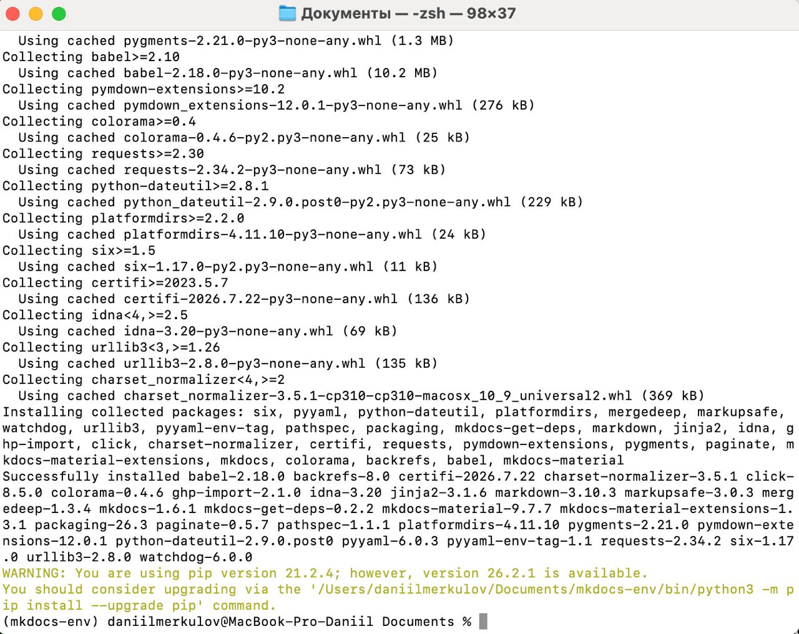
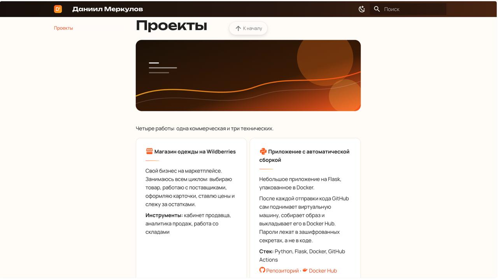
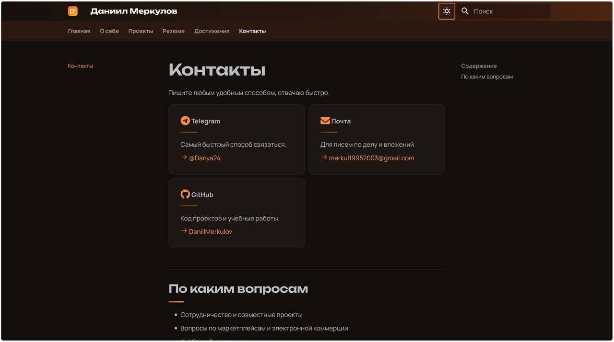

University: [ITMO University](https://itmo.ru/ru/)
Faculty: [FICT](https://fict.itmo.ru)
Course: [Введение в веб технологии]
Year: 2025/2026
Group: U4125
Author: Меркулов Даниил
Lab: Coursework
Date of create: 19.09.2026
Date of finished: [будет указано после защиты]

## Цель работы

Сделать персональный сайт на MkDocs и опубликовать его в интернете.

## Что за технология

MkDocs это генератор статических сайтов. Работает так: ты пишешь обычные текстовые файлы в разметке Markdown, а MkDocs превращает их в готовый сайт с навигацией, поиском и оформлением.

Статический сайт означает, что на выходе получаются простые html-файлы. Им не нужен ни сервер с базой данных, ни программирование на стороне сервера, поэтому такой сайт можно бесплатно разместить на GitHub Pages.

Внешний вид берётся из темы. Я использовал Material for MkDocs, самую популярную тему, в которой уже есть адаптивная вёрстка, поиск по сайту и переключение светлой и тёмной темы.

## Ход работы

### 1. Установка

Поставил MkDocs и тему Material через pip.

Сначала установка в системный Python не прошла из-за нехватки прав, поэтому сделал отдельное виртуальное окружение:

`python3 -m venv mkdocs-env`

`source mkdocs-env/bin/activate`

`pip install mkdocs mkdocs-material`

Виртуальное окружение это отдельная папка со своим Python и библиотеками. Оно нужно, чтобы пакеты проекта не смешивались с системными и не ломали друг друга.

Проверил установку: `mkdocs --version` вывела версию 1.6.1.



### 2. Настройка конфигурации

Создал репозиторий `my-personal-site` на GitHub, склонировал его и сделал структуру проекта: файл `mkdocs.yml` в корне и папку `docs` со страницами.

В `mkdocs.yml` прописал основные параметры сайта:

```
site_name: Даниил Меркулов
site_description: Персональный сайт студента магистратуры ИТМО
site_author: Меркулов Даниил
site_url: https://daniilmerkulov.github.io/my-personal-site/
```

Подключил тему Material и включил нужные возможности:

```
theme:
  name: material
  language: ru
  features:
    - navigation.tabs
    - navigation.sections
    - navigation.top
    - search.highlight
    - search.share
```

Что делают эти настройки: `navigation.tabs` выносит разделы в верхнее меню, `navigation.sections` показывает разделы в боковой панели, `navigation.top` добавляет кнопку возврата наверх, `search.highlight` подсвечивает найденные слова, `search.share` позволяет поделиться ссылкой на результат поиска.

Дальше описал навигацию, то есть порядок разделов в меню.

### 3. Создание страниц

Сделал шесть страниц:

1. Главная с обложкой, кратким рассказом о себе и ссылками на разделы
2. О себе с образованием, навыками и увлечениями
3. Проекты с описанием четырёх работ
4. Резюме с опытом и техническими навыками
5. Достижения с итогами учёбы и работы
6. Контакты со способами связи

На страницах использовал разные элементы Markdown: заголовки трёх уровней, маркированные и нумерованные списки, ссылки, изображения, цитату, таблицы и блоки-подсказки. Проекты и контакты оформил карточками, навыки вывел в виде чипов.




### 4. Оформление

Стандартная тема выглядела как документация, поэтому я поменял оформление через свой файл стилей `docs/stylesheets/extra.css`, который подключается в конфиге параметром `extra_css`.

Что настроил:

- Цветовую схему: оранжевый акцент с градиентами вместо стандартного синего
- Шрифты: Unbounded для заголовков и Manrope для основного текста
- Обложку на главной с градиентной заливкой
- Карточки с подсветкой при наведении
- Тёмную тему отдельными цветами, а не простой инверсией

Нарисовал три картинки в формате SVG и положил их в папку `docs/images`: логотип для шапки сайта, аватар с монограммой и обложку для страницы проектов.



В подвал сайта добавил иконки со ссылками на GitHub, Telegram и почту через раздел `extra.social` в конфиге.

### 5. Проверка и публикация

Локально проверял сайт командой `mkdocs serve`. Она поднимает сервер на 127.0.0.1:8000 и сама пересобирает страницы при каждом изменении файла, поэтому достаточно обновить вкладку в браузере.

Здесь поймал пару ошибок, которые видно только в браузере. Во-первых, полоса с вкладками сливалась с фоном. Во-вторых, картинки не открывались на внутренних страницах: MkDocs делает из каждой страницы отдельную папку, поэтому путь `images/cover.svg` превращался в несуществующий `projects/images/cover.svg`. Исправил на `../images/cover.svg`.

Для публикации выполнил `mkdocs gh-deploy`. Команда собирает сайт, создаёт в репозитории ветку `gh-pages`, кладёт туда готовые html-файлы и отправляет их на GitHub. Исходники при этом остаются в ветке `main`, они не смешиваются.

Сайт доступен по адресу: **https://daniilmerkulov.github.io/my-personal-site/**

## Результат

- Сайт на MkDocs с темой Material из шести страниц
- Работающая навигация и поиск по сайту
- Своё оформление: цветовая схема, шрифты, логотип и картинки
- Сайт опубликован на GitHub Pages и доступен всем
- Исходники лежат в репозитории, обновить сайт можно одной командой

## Вывод

Разобрался, как из обычных текстовых файлов получается готовый сайт. Главное, что понял: содержание и оформление можно разделить. Я пишу текст в Markdown и не думаю про вёрстку, а тема сама превращает его в страницы.

Отдельно оценил удобство публикации. Одна команда собирает сайт и выкладывает его в интернет, а чтобы что-то поменять, достаточно поправить текстовый файл и повторить её.
