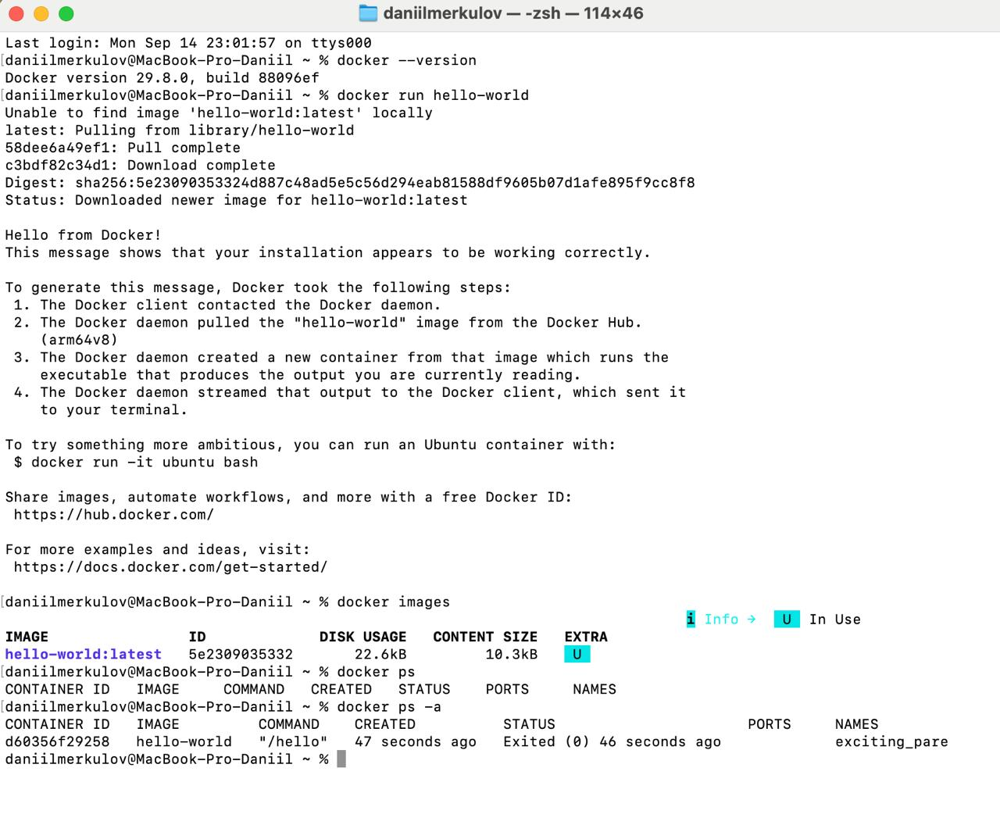
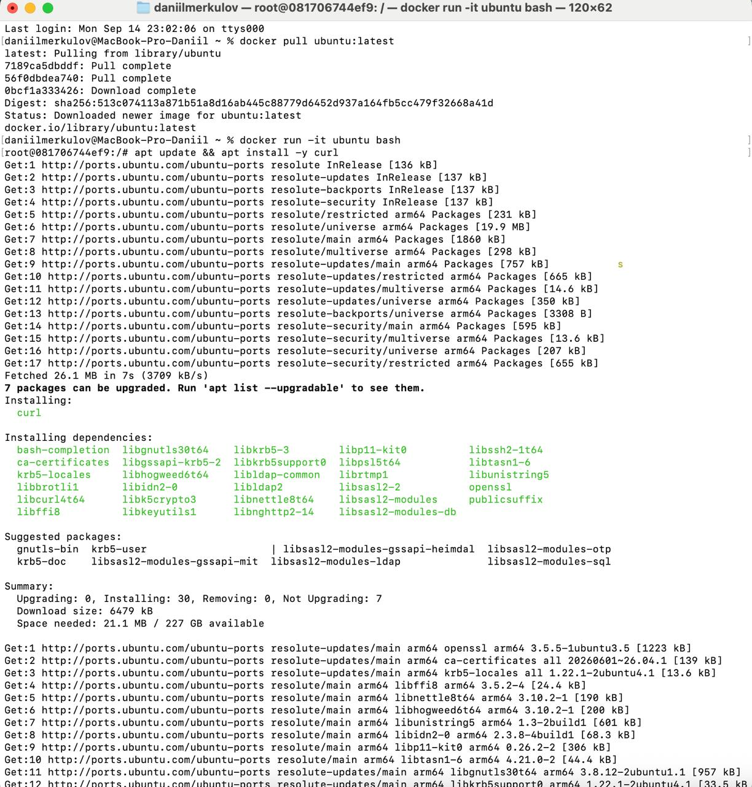
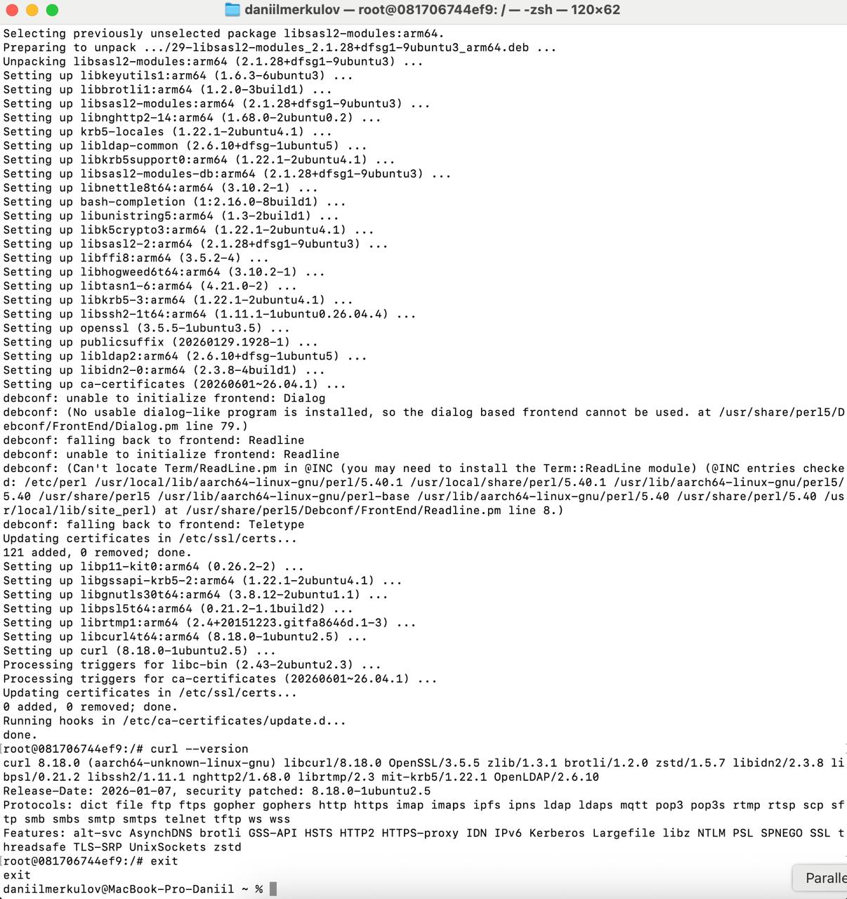
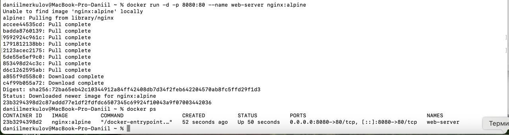
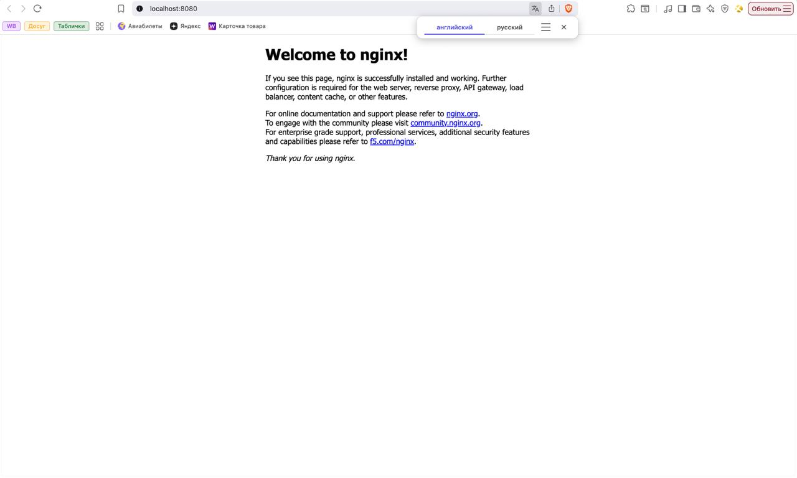
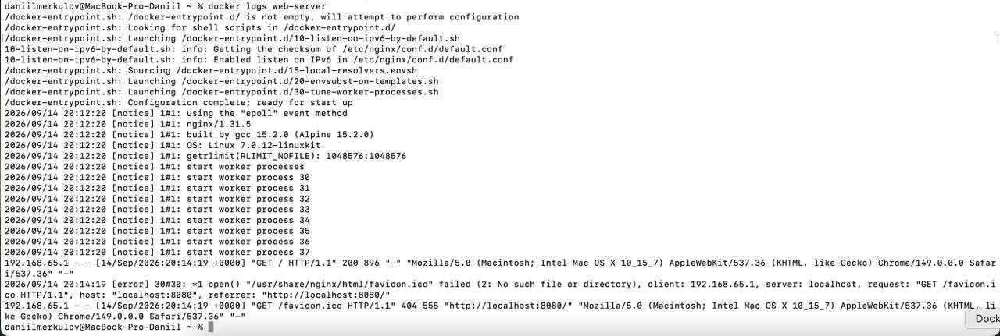
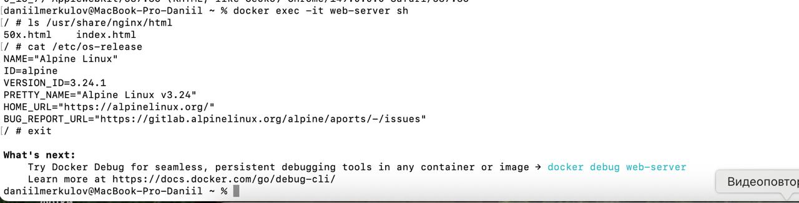
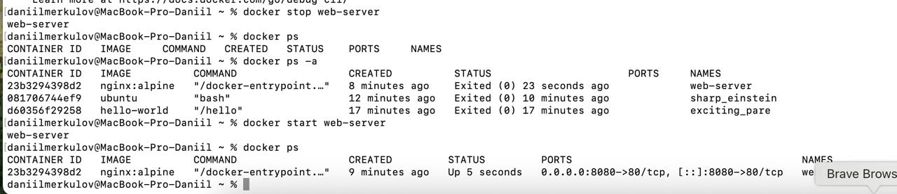
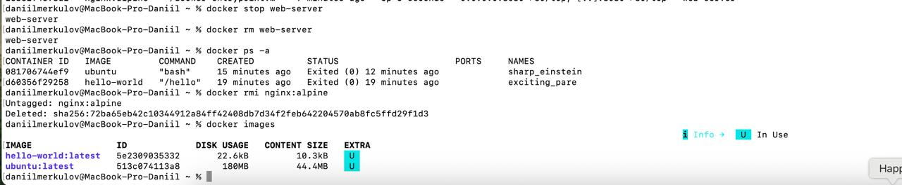
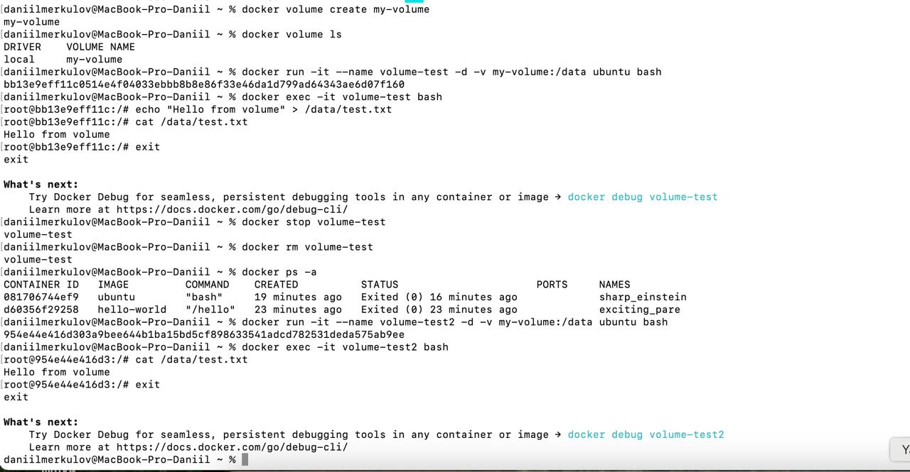

University: [ITMO University](https://itmo.ru/ru/)
Faculty: [FICT](https://fict.itmo.ru)
Course: [Введение в веб технологии]
Year: 2025/2026
Group: U4125
Author: Меркулов Даниил
Lab: Lab1
Date of create: 14.09.2026
Date of finished: [будет указано после защиты]

## Цель работы

Разобраться с основами Docker: установить его, научиться запускать контейнеры из готовых образов, управлять ими и работать с томами для хранения данных.

## Ход работы

### 1. Установка Docker и первый контейнер

Проверил версию — `docker --version` вывела `Docker version 29.8.0, build 88096ef`.

Дальше запустил тестовый контейнер `docker run hello-world`. Здесь хорошо видно, как Docker работает: образа у меня на компьютере не было (строчка `Unable to find image 'hello-world:latest' locally`), поэтому он сам скачал его с Docker Hub, создал контейнер, тот напечатал приветствие и завершился.

Потом посмотрел базовые команды:

- `docker images` — список скачанных образов, там появился hello-world
- `docker ps` — контейнеры, работающие прямо сейчас (пусто, потому что hello-world уже завершился)
- `docker ps -a` — вообще все контейнеры, включая остановленные. Тут hello-world есть, статус `Exited (0)`, где 0 значит, что завершился без ошибок.

### 2. Работа с готовым образом Ubuntu

Скачал образ командой `docker pull ubuntu:latest`

Запустил контейнер в интерактивном режиме: `docker run -it ubuntu bash`. Флаг `-i` включает интерактивный режим, `-t` выделяет терминал, а `bash` — программа, которая запускается внутри. После запуска приглашение поменялось на `root@081706744ef9:/#`, то есть я оказался внутри контейнера.

Внутри поставил curl: `apt update && apt install -y curl`.

Проверил результат: `curl --version` вывела `curl 8.18.0 (aarch64-unknown-linux-gnu)`.

Вышел командой `exit`.

### 3. Запуск веб-сервера

Запустил nginx: `docker run -d -p 8080:80 --name web-server nginx:alpine`.

Что означают флаги:

- `-d` — запуск в фоне, терминал сразу освобождается
- `-p 8080:80` — проброс портов: всё, что приходит на порт 8080 моего Mac, перенаправляется на порт 80 внутри контейнера, где слушает nginx
- `--name web-server` — своё имя контейнера, чтобы потом не искать его по случайному
- `nginx:alpine` — образ nginx на базе Alpine Linux, это очень лёгкий дистрибутив

После запуска `docker ps` показал контейнер со статусом `Up` и портами `0.0.0.0:8080->80/tcp`.

Открыл в браузере http://localhost:8080 — открылась страница «Welcome to nginx!». То есть веб-сервер из контейнера реально отвечает на запросы.

Посмотрел логи: `docker logs web-server`. Там видно и запуск самого nginx, и мой запрос из браузера с кодом 200.

Подключился внутрь работающего контейнера: `docker exec -it web-server sh`.

Важное отличие: `docker run` создаёт новый контейнер, а `docker exec` подключается к уже работающему.

Внутри посмотрел файлы сайта (`ls /usr/share/nginx/html` — там `index.html` и `50x.html`, то есть та самая страница из браузера) и проверил систему (`cat /etc/os-release` — Alpine Linux v3.24).

### 4. Управление контейнерами

Остановил контейнер: `docker stop web-server`. После этого `docker ps` стал пустым, а в `docker ps -a` контейнер остался со статусом `Exited`. Страница в браузере перестала открываться.

Запустил обратно: `docker start web-server`. Контейнер снова заработал со всеми прежними настройками — имя и проброс портов заново задавать не пришлось, страница в браузере открылась. В этом и разница: `run` создаёт новый контейнер, `start` поднимает уже существующий.

Удалил контейнер. Дальше удалил образ: `docker rmi nginx:alpine`.

### 5. Работа с томами

Тома нужны потому, что все данные внутри контейнера исчезают вместе с ним. Том — это отдельное хранилище, которым управляет Docker, и его можно подключать к разным контейнерам.

Создал том (`docker volume create my-volume`) и посмотрел список (`docker volume ls`).

Запустил контейнер с подключённым томом:

`docker run -it --name volume-test -d -v my-volume:/data ubuntu bash`

Зашёл внутрь (`docker exec -it volume-test bash`) и создал файл командой `echo "Hello from volume" > /data/test.txt`, проверил через `cat` — текст на месте.

Потом остановил и удалил контейнер (`docker stop volume-test`, `docker rm volume-test`) и убедился по `docker ps -a`, что его больше нет.

Создал новый контейнер с тем же томом:

`docker run -it --name volume-test2 -d -v my-volume:/data ubuntu bash`

Зашёл внутрь и проверил файл: `cat /data/test.txt` вывел `Hello from volume`. То есть контейнер, в котором файл создавался, удалён (у нового и ID другой — `954e44e416d3` вместо `bb13e9eff11c`), а файл сохранился, потому что лежит в томе, а не внутри контейнера.

## Вывод

Установил Docker и разобрался с основными вещами: чем образ отличается от контейнера (образ — шаблон, контейнер — запущенная копия), как запускать контейнеры в интерактивном и фоновом режиме, как пробрасывать порты наружу, как смотреть логи и заходить внутрь работающего контейнера.

Отдельно понял смысл томов: контейнеры по своей сути одноразовые, и если данные нужно сохранить, держать их надо в томе, который живёт независимо от контейнера.
