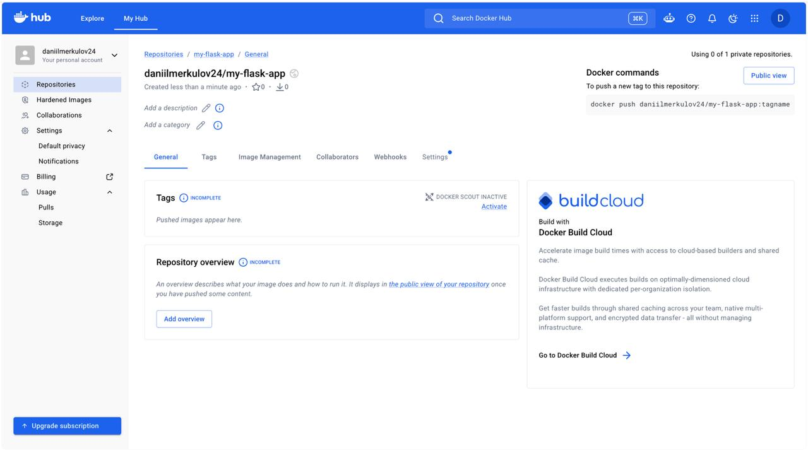
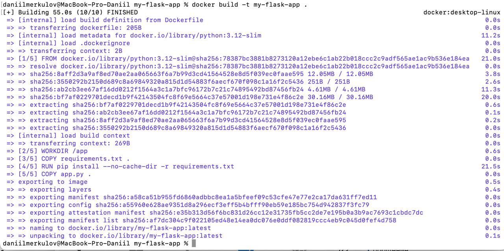
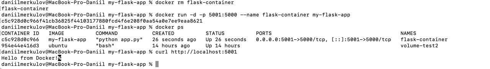
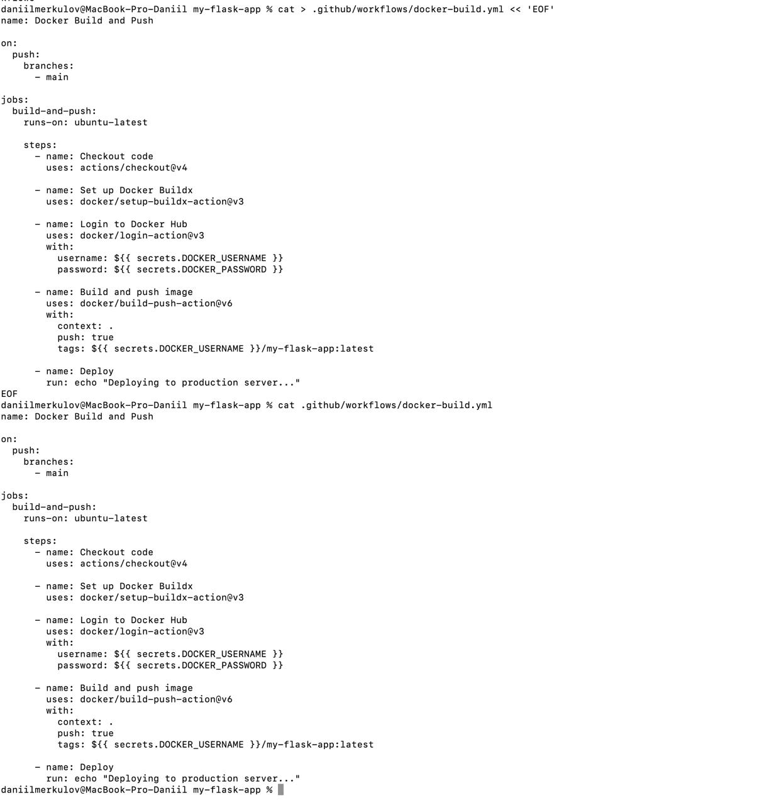
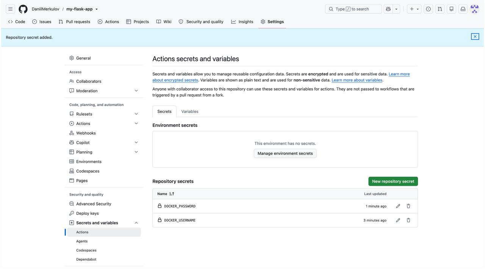
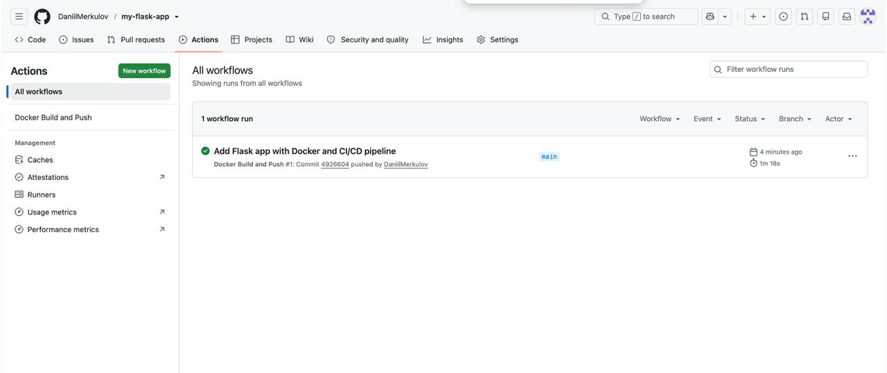
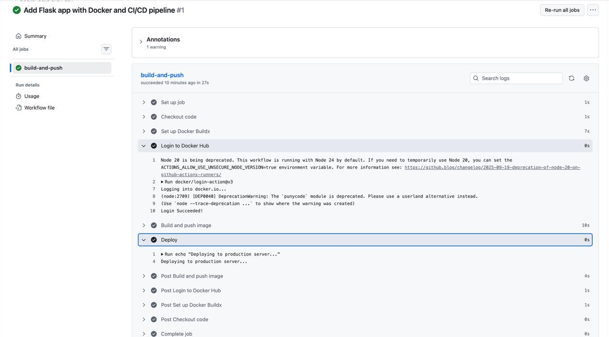
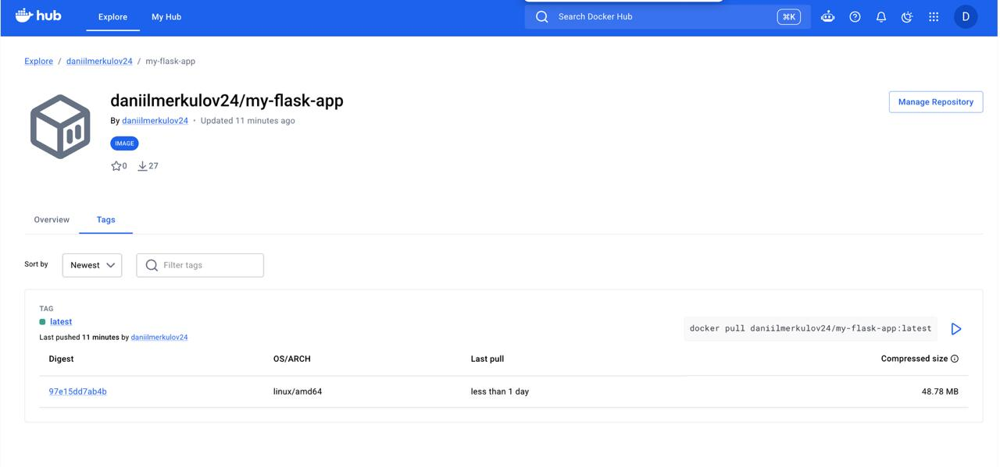

University: [ITMO University](https://itmo.ru/ru/)
Faculty: [FICT](https://fict.itmo.ru)
Course: [Введение в веб технологии]
Year: 2025/2026
Group: U4125
Author: Меркулов Даниил
Lab: Lab2
Date of create: 15.09.2026
Date of finished: [будет указано после защиты]

## Цель работы

Настроить CI/CD пайплайн, который при каждом изменении кода сам собирает Docker-образ, публикует его в Docker Hub и выполняет деплой.

## Ход работы

### 1. Подготовка проекта

Сначала зарегистрировался на Docker Hub (логин `daniilmerkulov24`) и создал там публичный репозиторий `my-flask-app` — именно туда пайплайн будет загружать собранный образ.

Дальше создал Access Token в настройках аккаунта (раздел Personal access tokens, права Read & Write). Токен нужен вместо обычного пароля: его можно отозвать одной кнопкой, если он утечёт, и аккаунт при этом не пострадает.



Потом создал новый репозиторий на GitHub `my-flask-app` и склонировал его к себе.

В корне репозитория сделал три файла:

- `app.py` — простое приложение на Flask, отвечает «Hello from Docker!» на запрос к главной странице
- `requirements.txt` — список библиотек (`Flask==3.0.3`)
- `Dockerfile` — рецепт сборки образа

Содержимое Dockerfile:

```
FROM python:3.12-slim
WORKDIR /app
COPY requirements.txt .
RUN pip install --no-cache-dir -r requirements.txt
COPY app.py .
EXPOSE 5000
CMD ["python", "app.py"]
```

Что делает каждая строчка: `FROM` берёт за основу готовый образ с Python, `WORKDIR` задаёт рабочую папку внутри контейнера, `COPY` копирует файлы внутрь образа, `RUN` выполняет команду во время сборки (ставит Flask), `EXPOSE` сообщает, какой порт слушает приложение, `CMD` указывает, что запускать при старте контейнера.

Зависимости копируются и ставятся отдельно от кода не случайно: Docker кеширует шаги, поэтому при изменении только кода шаг с установкой библиотек не повторяется и сборка идёт быстрее.

Перед настройкой автоматики проверил, что всё собирается руками:

`docker build -t my-flask-app .`

В выводе видно, как Docker выполняет шаги из Dockerfile по порядку: скачивает базовый образ python:3.12-slim, создаёт рабочую директорию, копирует файлы и ставит Flask. Сборка заняла 55 секунд.



Дальше запустил контейнер и проверил приложение:

`docker run -d -p 5001:5000 --name flask-container my-flask-app`
`curl http://localhost:5001`

Приложение ответило `Hello from Docker!`

Здесь поймал ошибку `ports are not available: address already in use` — на macOS порт 5000 занят системной службой AirPlay. Решил пробросом на другой порт: снаружи 5001, внутри контейнера по-прежнему 5000. Это хорошо показывает смысл проброса портов — внутренний порт менять не пришлось.



### 2. Настройка GitHub Actions

Создал папку `.github/workflows/` — GitHub сам смотрит в неё и считает все `.yml` файлы оттуда инструкциями для запуска.

Файл `docker-build.yml`:

```
name: Docker Build and Push

on:
  push:
    branches:
      - main

jobs:
  build-and-push:
    runs-on: ubuntu-latest

    steps:
      - name: Checkout code
        uses: actions/checkout@v4

      - name: Set up Docker Buildx
        uses: docker/setup-buildx-action@v3

      - name: Login to Docker Hub
        uses: docker/login-action@v3
        with:
          username: ${{ secrets.DOCKER_USERNAME }}
          password: ${{ secrets.DOCKER_PASSWORD }}

      - name: Build and push image
        uses: docker/build-push-action@v6
        with:
          context: .
          push: true
          tags: ${{ secrets.DOCKER_USERNAME }}/my-flask-app:latest

      - name: Deploy
        run: echo "Deploying to production server..."
```

Разбор:

- `on: push: branches: main` — триггер, то есть условие запуска. Пайплайн стартует при каждом пуше в ветку main.
- `runs-on: ubuntu-latest` — GitHub поднимает чистую виртуальную машину с Ubuntu у себя в облаке, прогоняет на ней все шаги и потом удаляет.
- `uses:` — готовый блок (action), написанный кем-то другим. Например, `actions/checkout@v4` — блок checkout версии 4.
- `run:` — обычная команда в терминале этой виртуалки.

Что делают шаги по порядку: **Checkout code** скачивает мой код на виртуалку (без этого машина пустая и собирать нечего), **Set up Docker Buildx** включает продвинутый сборщик образов, **Login to Docker Hub** авторизуется по секретам, **Build and push image** собирает образ и сразу загружает его в Docker Hub, **Deploy** выводит сообщение о деплое.



### 3. Настройка секретов

В настройках репозитория (Settings → Secrets and variables → Actions) добавил два секрета:

- `DOCKER_USERNAME` — логин на Docker Hub
- `DOCKER_PASSWORD` — тот самый Access Token

Смысл секретов в том, что пароль нигде не лежит открытым текстом. В файле пайплайна написано только `${{ secrets.DOCKER_PASSWORD }}`, а реальное значение хранится зашифрованным у GitHub и подставляется в момент запуска. В логах оно автоматически заменяется звёздочками.

Имена секретов должны совпадать с теми, что указаны в файле, буква в букву.



### 4. Тестирование пайплайна

Сделал коммит и отправил код на GitHub:

`git add .`
`git commit -m "Add Flask app with Docker and CI/CD pipeline"`
`git push -u origin main`

Сразу после пуша во вкладке Actions появился запуск пайплайна. Через 1 минуту 18 секунд он завершился с зелёной галочкой.



Посмотрел логи каждого шага. На шаге Login to Docker Hub видно `Login Succeeded!`, причём сам токен в логах не показывается. На шаге Deploy вывелось `Deploying to production server...`



Проверил Docker Hub — образ появился с тегом `latest`, размер около 49 МБ.

Заметил интересную деталь: архитектура образа `linux/amd64`, хотя когда я собирал образ локально, получался arm64 (у меня Mac на Apple Silicon). Так вышло потому, что виртуалки GitHub работают на процессорах Intel/AMD. То есть один и тот же Dockerfile на разных машинах даёт образы под разные архитектуры.



## Вывод

Настроил полный автоматический цикл: я меняю код и делаю push, а дальше всё происходит само — GitHub поднимает чистую виртуалку, скачивает на неё код, собирает Docker-образ, публикует его в Docker Hub и выполняет шаг деплоя.

Главное, что понял из этой работы: CI/CD убирает ручную рутину и человеческий фактор. Раньше я собирал и запускал образ руками и мог что-то забыть, а теперь эти шаги описаны один раз в файле и выполняются одинаково при каждом изменении кода.

Отдельно разобрался с секретами — пароли и токены нельзя держать в коде, потому что репозиторий публичный и их увидит кто угодно. Вместо этого они лежат в зашифрованном хранилище GitHub, а в пайплайне используется только ссылка на них.
