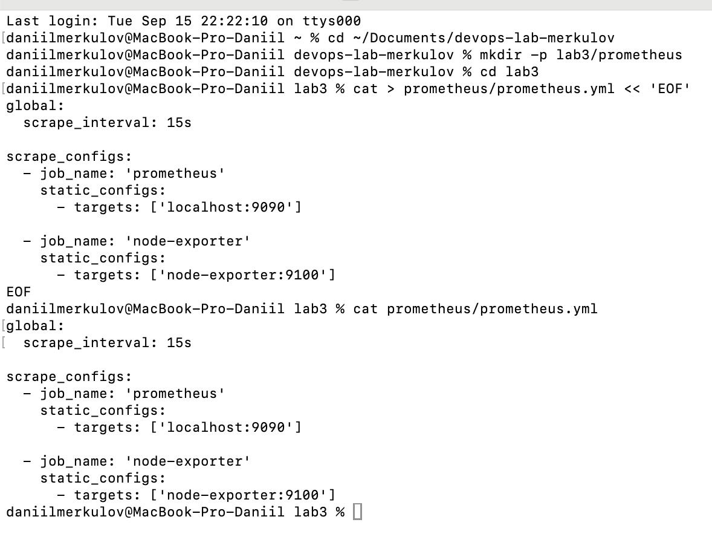
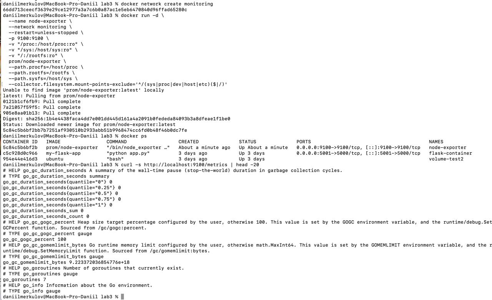
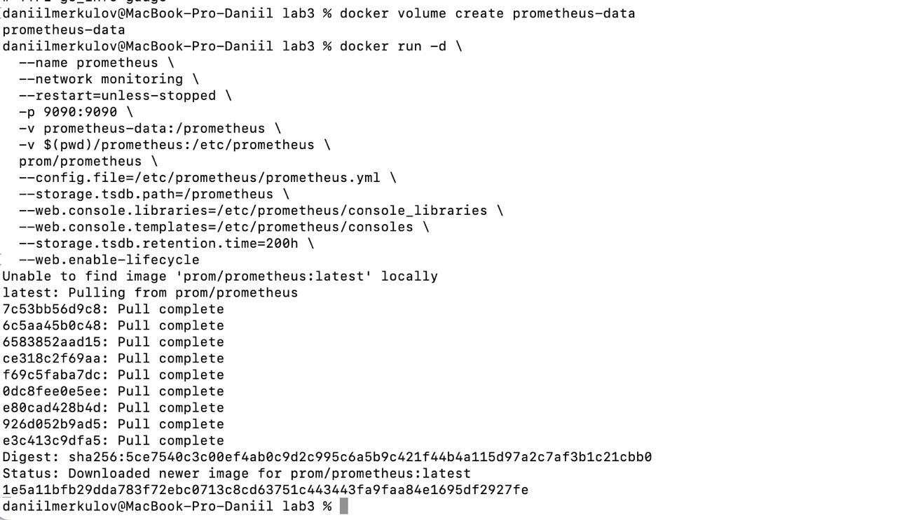
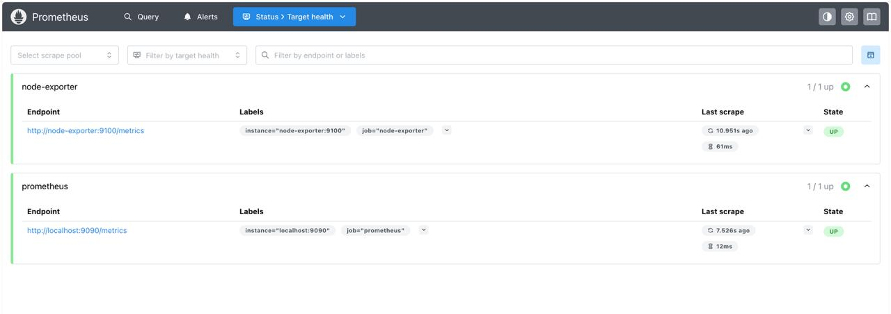
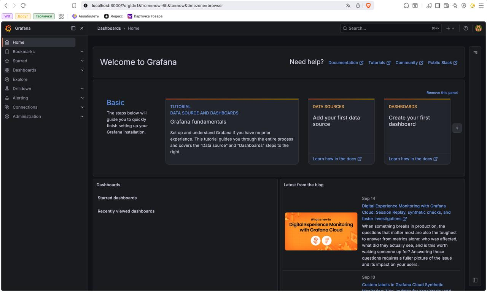
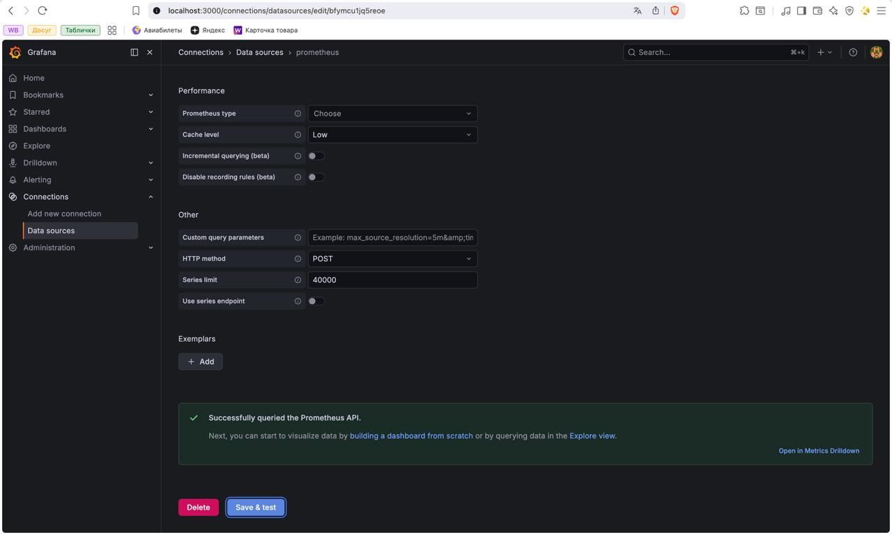
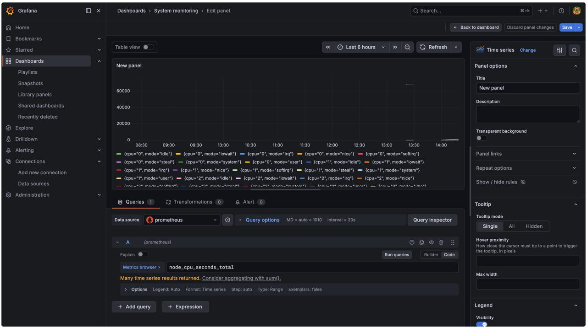
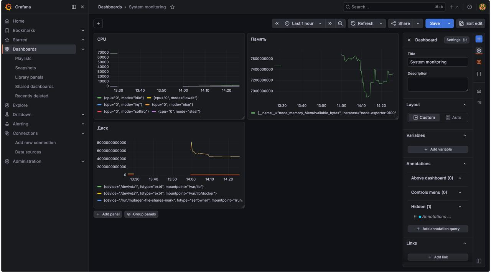
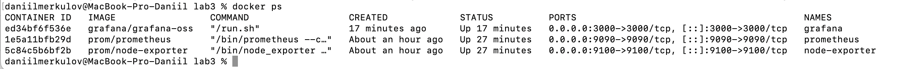

University: [ITMO University](https://itmo.ru/ru/)
Faculty: [FICT](https://fict.itmo.ru)
Course: [Введение в веб технологии]
Year: 2025/2026
Group: U4125
Author: Меркулов Даниил
Lab: Lab3
Date of create: 18.09.2026
Date of finished: [будет указано после защиты]

## Цель работы

Настроить систему мониторинга: Prometheus собирает метрики о состоянии системы, Grafana строит по ним графики.

## Как это устроено

Разделение труда между тремя программами:

- **Node Exporter** снимает показатели с системы (процессор, память, диск) и отдаёт их по адресу в понятном формате.
- **Prometheus** раз в 15 секунд обходит все адреса, забирает оттуда цифры и складывает в свою базу. Сам ничего не рисует.
- **Grafana** строит графики по данным из Prometheus. Сама ничего не собирает.

## Ход работы

### 1. Конфигурация Prometheus

Создал папку `prometheus` и файл `prometheus.yml`:

```
global:
  scrape_interval: 15s

scrape_configs:
  - job_name: 'prometheus'
    static_configs:
      - targets: ['localhost:9090']

  - job_name: 'node-exporter'
    static_configs:
      - targets: ['node-exporter:9100']
```

`scrape_interval: 15s` задаёт, как часто ходить за метриками. `scrape_configs` — список источников: первый Prometheus собирает сам с себя, второй — с node-exporter.

Конфиг написан в формате YAML, где вложенность задаётся отступами, поэтому `static_configs` стоит внутри каждой задачи со сдвигом вправо.



### 2. Сеть и Node Exporter

Сначала создал сеть для контейнеров:

`docker network create monitoring`

Сеть в Docker — это изолированное пространство, внутри которого контейнеры видят друг друга по именам. Именно поэтому в конфиге можно писать адрес `node-exporter:9100` вместо IP-адреса.

Запуск Node Exporter:

```
docker run -d \
  --name node-exporter \
  --network monitoring \
  --restart=unless-stopped \
  -p 9100:9100 \
  -v "/proc:/host/proc:ro" \
  -v "/sys:/host/sys:ro" \
  -v "/:/rootfs:ro" \
  prom/node-exporter \
  --path.procfs=/host/proc \
  --path.rootfs=/rootfs \
  --path.sysfs=/host/sys
```

Три монтирования нужны потому, что node-exporter читает показатели из папок `/proc` и `/sys` — это виртуальные папки Linux, куда ядро выкладывает данные о железе. Пометка `:ro` означает «только чтение», то есть контейнер ничего там не изменит.

Флаг `--restart=unless-stopped` поднимает контейнер автоматически при перезапуске Docker, если только его не остановили вручную.

Проверил, что метрики отдаются:

`curl -s http://localhost:9100/metrics | head -20`

Вывелись строки вида `имя_метрики значение` — это и есть сырые данные, которые будет забирать Prometheus.



### 3. Запуск Prometheus

Создал том `prometheus-data`, чтобы собранные метрики не пропадали вместе с контейнером.

```
docker run -d \
  --name prometheus \
  --network monitoring \
  --restart=unless-stopped \
  -p 9090:9090 \
  -v prometheus-data:/prometheus \
  -v $(pwd)/prometheus:/etc/prometheus \
  prom/prometheus \
  --config.file=/etc/prometheus/prometheus.yml \
  --storage.tsdb.path=/prometheus \
  --storage.tsdb.retention.time=200h \
  --web.enable-lifecycle
```

Два флага `-v` здесь разного смысла: первый подключает том для базы данных, второй прокидывает мою папку с конфигом внутрь контейнера (`$(pwd)` подставляет текущую папку).

`--storage.tsdb.path` указывает, где хранить базу. TSDB расшифровывается как time series database, база временных рядов — она заточена под данные вида «значение в такой-то момент времени». `--storage.tsdb.retention.time=200h` означает хранить метрики 200 часов, а более старые удалять, иначе диск со временем кончится.



Открыл http://localhost:9090 и проверил раздел Status → Target health. Обе цели показали статус **UP**: Prometheus успешно достучался и до себя по адресу `http://localhost:9090/metrics`, и до node-exporter по адресу `http://node-exporter:9100/metrics`.



### 4. Запуск Grafana

Создал том `grafana-data` для настроек и дашбордов, затем запустил контейнер:

```
docker run -d \
  --name grafana \
  --network monitoring \
  --restart=unless-stopped \
  -p 3000:3000 \
  -v grafana-data:/var/lib/grafana \
  -e "GF_SECURITY_ADMIN_PASSWORD=admin" \
  grafana/grafana-oss
```

Флаг `-e` задаёт переменную окружения — это способ передать настройку внутрь контейнера снаружи, не меняя сам образ. Здесь через него задаётся пароль администратора.

Grafana тоже подключена к сети `monitoring` — без этого она не смогла бы обратиться к Prometheus по имени.

Зашёл на http://localhost:3000 под логином admin и паролем admin.



### 5. Настройка Grafana

Добавил источник данных: Connections → Data sources → Prometheus. В поле URL указал:

`http://prometheus:9090`

Важный момент: здесь `prometheus` — это имя контейнера, а не адрес сайта. Работает потому, что Grafana и Prometheus находятся в одной сети `monitoring`. Если написать `localhost:9090`, не сработает: для Grafana внутри её контейнера `localhost` означает саму Grafana.

После нажатия Save & test появилось подтверждение «Successfully queried the Prometheus API» — значит Grafana достучалась до Prometheus.



Создал дашборд `System monitoring` и добавил первую панель. В редакторе панели выбрал источник данных Prometheus, переключился в режим Code и вписал метрику `node_cpu_seconds_total`.



Так же добавил ещё две панели, всего получилось три:

- **CPU** — метрика `node_cpu_seconds_total`
- **Память** — метрика `node_memory_MemAvailable_bytes`
- **Диск** — метрика `node_filesystem_avail_bytes`

На графике CPU видно много линий вида `{cpu="0", mode="idle"}` — метрика разбита по ядрам процессора и режимам его работы. Это счётчик, который только растёт с момента запуска системы, поэтому значения большие. Для отображения реальной загрузки в процентах используют функцию `rate()`.

На графиках памяти и диска видно, как значения меняются со временем — это как раз то, ради чего нужен мониторинг: заметить тенденцию заранее, а не когда место уже закончилось.



### 6. Проверка системы

Команда `docker ps` показала все три контейнера со статусом Up: grafana, prometheus и node-exporter, каждый на своём порту (3000, 9090 и 9100).



## Вывод

Собрал рабочую систему мониторинга из трёх контейнеров, где каждый занимается своим делом: node-exporter снимает показатели с системы, Prometheus их собирает и хранит, Grafana рисует графики.

Главное, что понял из этой работы: контейнеры общаются между собой по именам, но только внутри общей сети Docker. Поэтому и Prometheus, и Grafana подключены к сети `monitoring` — без неё они не нашли бы друг друга, хотя работают на одном компьютере.

Ещё разобрался, чем метрика отличается от графика. Prometheus хранит просто числа со временем, и в них самих смысла мало. Смысл появляется, когда Grafana выстраивает их в линию и становится видно, что память убывает, а место на диске заканчивается.
